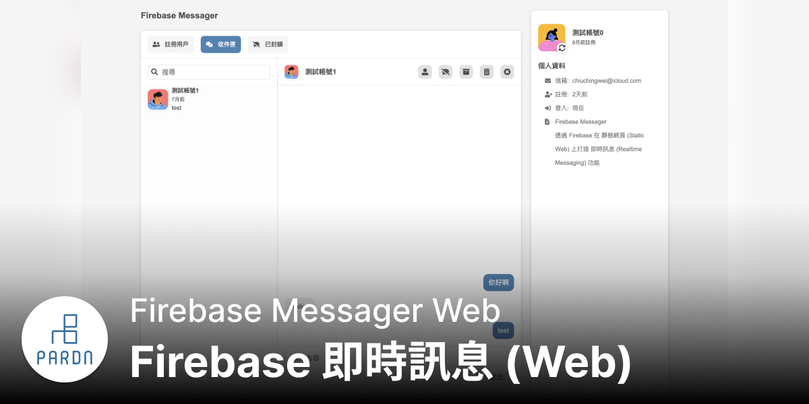
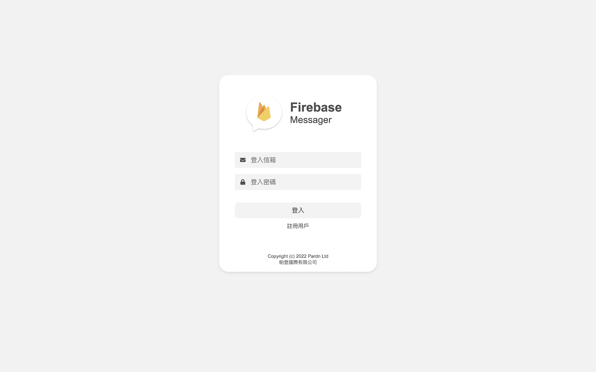
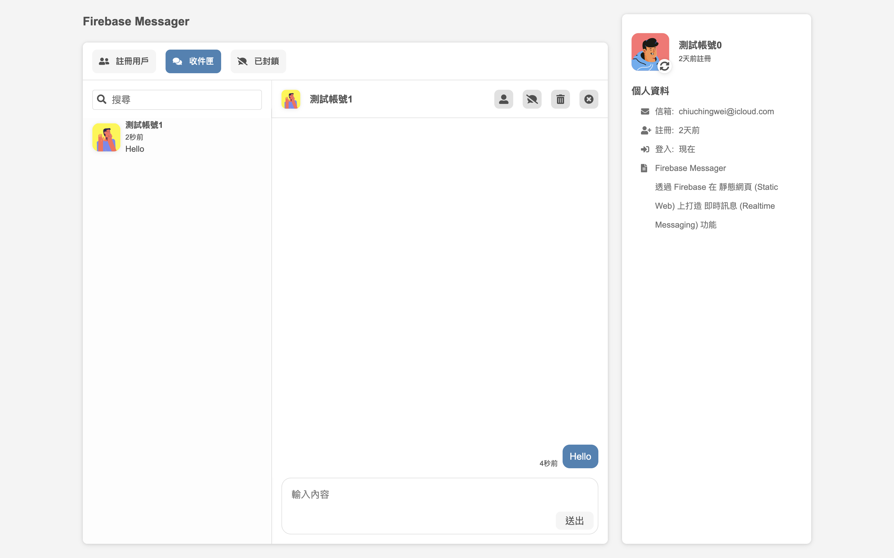
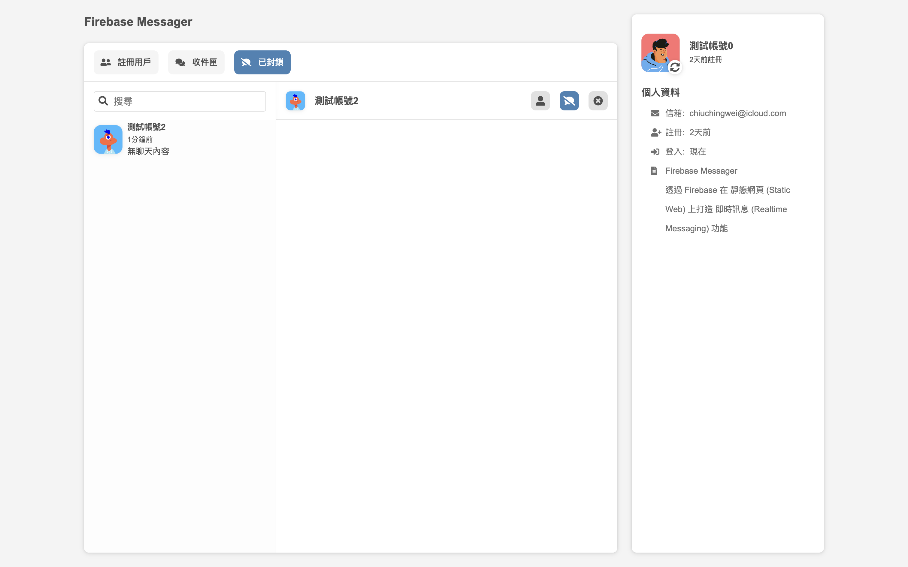
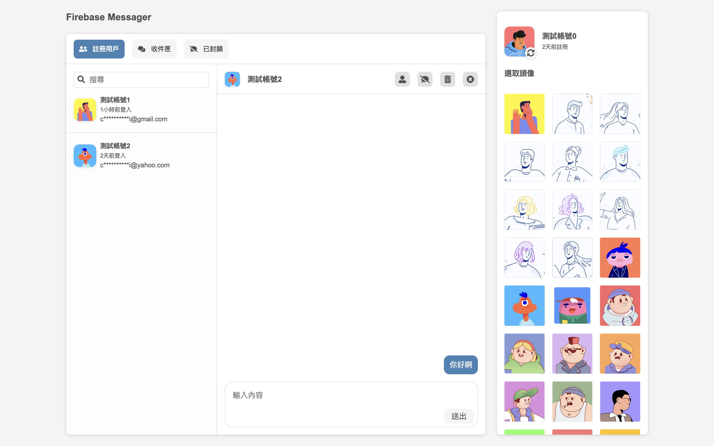
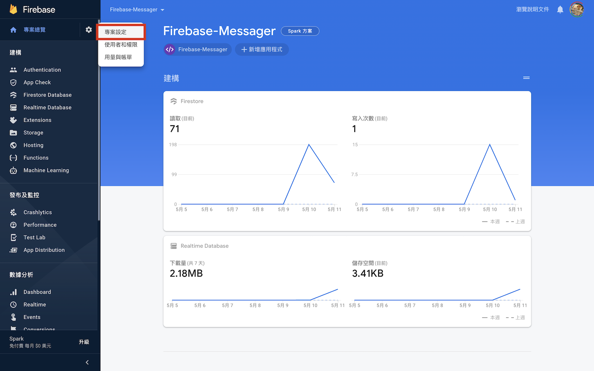
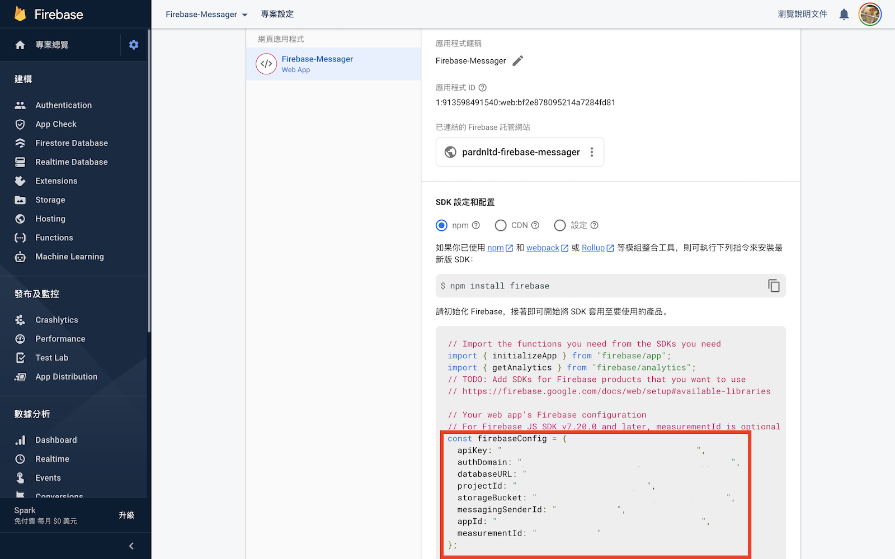
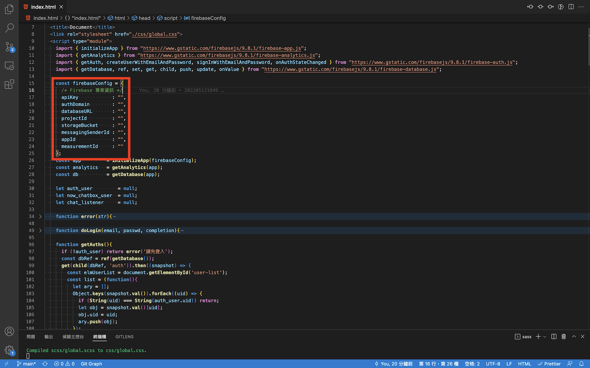

***

# Firebase 即時訊息 (Web)

透過 **Firebase** 在 **靜態網頁 (Static Web)** 上打造 **即時訊息 (Realtime Messaging)** 功能

- Html, Css / Sass, Javascript, [Firebase JS](https://firebase.google.com/docs/web/setup), [Font Awesome 5](https://fontawesome.com/v5/search), [Userpics](https://userpics.craftwork.design)
- [preview](https://pardnchiu.github.io/firebase-messager-web/)
- [github.com](https://github.com/pardnchiu/firebase-messager-web)
- [Pardn Ltd 帕登國際有限公司](https://www.linkedin.com/company/pardnltd)
- [Pardn Chiu 邱敬幃](https://www.linkedin.com/in/pardnchiu)
- [joball.tw/@pardnltd](https://joball.tw/@pardnltd)
- [lin.ee/Gtcb5kc](http://lin.ee/Gtcb5kc)

***

| 預覽 |
| --- |
| 
| 
| 
| 

***

本機測試 CORS 問題

- Safari 
  ```
  停用本機檔案讀取限制
  ```
- Chrome (Mac)
  ```
  open -n -a /Applications/Google\ Chrome.app/Contents/MacOS/Google\ Chrome --args --user-data-dir="/tmp/chrome_dev_test" --disable-web-security
  ```
- Chrome (Windows)
  ```
  "[PATH_TO_CHROME]\chrome.exe" --disable-web-security --disable-gpu --user-data-dir=~/chromeTemp
  ```
- Chrome (Linux)
  ```
  google-chrome --disable-web-security
  ```

***

### Firebase 導入教學

| 進入專案頁面 |
| --- |
|  |

| 拷貝專案資訊 |
| --- |
|  |

| 貼上專案資訊 |
| --- |
|  |

***

Copyright (c) 2022 [Pardn Ltd 帕登國際有限公司](https://www.linkedin.com/company/pardnltd)
